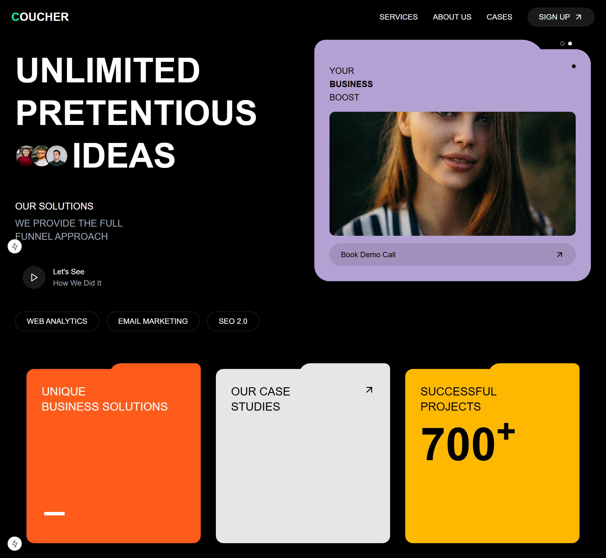

# GDGC task round- Frontend Task

This project is a frontend implementation of the Oucher website design, created as part of the GDGC task round. The design is based on [this Dribbble shot](https://dribbble.com/shots/20662887-Oucher-Web-Site-Design-Landing-Page-Home-Page-UI).

## 🚀 Live Demo

Check out the live deployment: [Oucher Landing Page](your-deployment-url-here)

## 🛠️ Technologies Used

- **Next.js 14** - React framework for production
- **TypeScript** - For type-safe code
- **Tailwind CSS** - For styling
- **Framer Motion** - For animations
- **React Icons** - For UI icons
